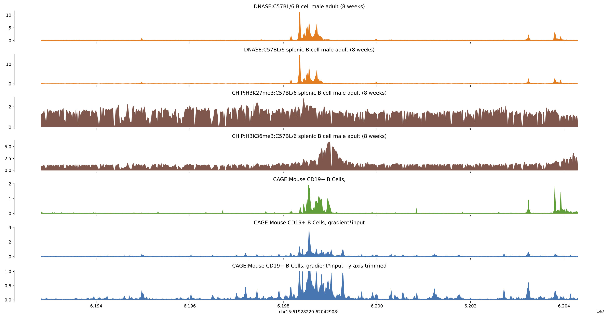

# Enformer

This repository contains the code to use the Enformer model introduced by [DeepMind](https://www.deepmind.com/blog/predicting-gene-expression-with-ai) in the paper [Effective gene expression prediction from sequence by integrating long-range interactions](https://www.nature.com/articles/s41592-021-01252-x), to make predictions on new sequences.  
Usage based on https://colab.research.google.com/github/deepmind/deepmind_research/blob/master/enformer/enformer-usage.ipynb#scrollTo=si-w2NPretDg

Enformer is a transformer-based neural network architecture (based on self-attention) with the ability to predict chromatin data and gene expression from DNA sequences with greater accuracy. The model was trained to predict thousands of epigenetic and transcriptional datasets in a multitask setting across long DNA sequences. The input sequence length is 393,216. The predicted output corresponds to 128 base pair windows for the center 114,688 base pairs.  
You can find out more about it at https://github.com/deepmind/deepmind-research/tree/master/enformer.

<br>


# Make predictions to new sequences
Prepare your environment:
```
# Clone this repository
git clone https://github.com/bernardo-de-almeida/Enformer_predictions.git
cd Enformer_predictions

# download the genome of interest if you don't have it
wget -O - http://hgdownload.cse.ucsc.edu/goldenPath/hg38/bigZips/hg38.fa.gz | gunzip -c > hg38.fa # mouse
wget -O - http://hgdownload.cse.ucsc.edu/goldenPath/mm10/bigZips/mm10.fa.gz | gunzip -c > mm10.fa # mouse

# create 'Enformer' conda environment by running the following:
conda create -n Enformer python=3.7
conda install pandas numpy matplotlib seaborn
pip install tensorflow
pip install --upgrade tensorflow-hub
pip install kipoiseq==0.5.2
pip install pyfaidx
pip install joblib
pip install pyBigWig

# activate environment
conda activate Enformer
```

Run prediction script (using example from [paper Fig 1](https://www.nature.com/articles/s41592-021-01252-x#Fig1)):
```
python Enformer_single_sequence.py -d hg38.fa \
    -s human \
    -f 41,42,706,4799 \
    -i chr11:35082742-35197430 \
    -o test_interval \
    -t 0 -p 1 -b 0
```
Where:
* -d FASTA sequence file: Genome fasta file if providing interval, or fasta sequence of interest to make predictions
* -s species of features/targets of interest: 'human' or 'mouse' (see tables below for details)
* -f feature/target IDs from table indexes to get predictions for: e.g. '0,23,809' (see tables below for details)
* -i genomic interval: e.g. 'chr11:35082742-35197430'; will be resized to match model input size
* -o output name to label files
* -t save full table of predictions for all feature/targets?: 0/1
* -p plot tracks per feature/target of interest?: 0/1
* -b create bigwigs per predicted track?: 0/1

<br>
Target features of interest (from [Kelley et al., PLoS Comput Biol 2020](https://journals.plos.org/ploscompbiol/article?id=10.1371/journal.pcbi.1008050)):
- [human (n=5,313)](https://raw.githubusercontent.com/calico/basenji/master/manuscripts/cross2020/targets_human.txt)
- [mouse (n=1,643)](https://raw.githubusercontent.com/calico/basenji/master/manuscripts/cross2020/targets_mouse.txt)

<br>
The outputs are:
- csv file with genomic bins predictions per feature/target of interest
- csv file with genomic bins predictions for all feature/target of species [if t=1]
- pdf with tracks per feature/target of interest, including for each CAGE track the correspoding track with computed gradient*input contribution scores towards the center
- bigwigs for tracks per feature/target of interest in folder ${output}_tracks [if b=1]

## Example for HBE1 human locus
The β-globin locus contains five globin genes and has been extensively characterized. It includes 5 regulatory elements marked by DNase accessibility, termed HS1-5. Prior [work](https://www.nature.com/articles/nmeth.3630) has found that HS2 strongly activates
transcription in comparison with HS1 and HS3-5 (see barplots under the tracks).

<br></br>


Figure adapted from [Agarwal et al.](https://www.biorxiv.org/content/10.1101/2023.03.05.531189v1)

Let's see what Enformer predicts for this region, both in terms of chromatin states and gene expression, but also the importance of each of these regulatory elements to HBE1 expression!

Predictions for hg38 region centred on human HBE1 TSS: chr11:5229921-5306870
Features include DNASE, CHIP:GATA1 and CAGE for leukemia cell line K562 (where HBE1 should be active), together with DNASE and CAGE for brain samples as control
```
Enformer_single_sequence.py -d hg38.fa \
    -s human \
    -f 121,4828,370,1330,4980 \
    -i chr11:5229921-5306870 \
    -o HBE1_locus \
    -t 1 -p 1 -b 0
```
See predicted tracks below.

<br>

## Example for myc mouse locus
Predictions for mm10 region centred on mouse myc TSS: chr15:61928220-62042908
```
Enformer_single_sequence.py -d mm10.fa \
    -s mouse \
    -f 5315,5316,5691,5692,6938 \
    -i chr15:61928220-62042908 \
    -o myc_TSS \
    -t 1 -p 1 -b 0
```
See predicted tracks below.

<br>

# Tutorial
A tutorial that explains the different steps can be found in the following colab notebook: https://colab.research.google.com/drive/1qknFWSiRdCHM_ghC4Lw6wxry-kNIZCic?usp=sharing. You can run this notebook yourself to experiment with Enformer.  
This code and tutorial are based on the [enformer-usage colab](https://github.com/deepmind/deepmind-research/tree/master/enformer#enformer-usageipynb-).

